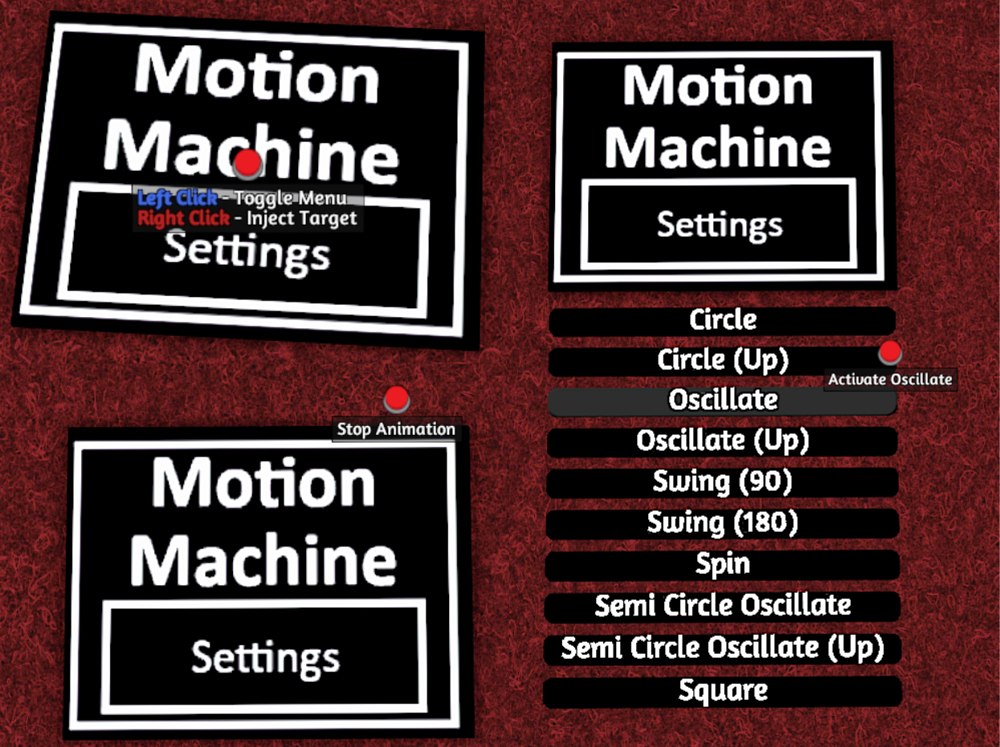

# Motion Machine: Tabletop Simulator Lua Script: 

🎲 Welcome to Motion Machine! This Lua script adds dynamic and animated movements to tabletop game objects in Tabletop Simulator. \
🕹️Apply preset movement to any object in TTS. Perfect for making maps that use traps or motion. Is persistent through saves and with One World. 

## Features
- **Responsive Menus:** Menus dynamically change based on animation state.
- **Smooth Transitions:** Animations utilize smooth movement for a polished experience.
- **Injection Functionality:** Players can inject animations into **selected objects** using the right-click menu.
- **Save and Load:** Animation states are saved and loaded for persistence across game sessions. Compatible with **One World**.

## How to Use
1. Subscribe to the [Motion Machine](https://steamcommunity.com/sharedfiles/filedetails/?id=3037763814) mod on the Steam Workshop.
2. Use the settings menu to see the list of animations.
3. Select an animation from the list to apply it to the object.
4. Use the right-click to inject the animation menu into **selected objects**.

Example:  

## Animations

- 🔄 Circle: Execute a circular motion.
- 🔄🔼 Circle (Up): Initiate a circular motion in an upward direction.
- 🔀 Oscillate: Trigger an oscillating movement.
- 🔀🔼 Oscillate (Up): Start an oscillating motion in an upward direction.
- 🔄📐Swing (90): Perform a swinging motion at a 90-degree angle.
- 🔄📐Swing (180): Perform a swinging motion at a 180-degree angle.
- 🌀 Spin: Initiate a spinning motion.
- 🔄🔀 Semi Circle Oscillate: Execute a semi-circular oscillating movement.
- 🔄🔀🔼 Semi Circle Oscillate (Up): Initiate a semi-circular oscillating motion (hop).

Feel free to modify the parameters, add new animations, or customize the menu system to suit your tabletop gaming needs. Have fun animating your game objects in Tabletop Simulator! 🎉